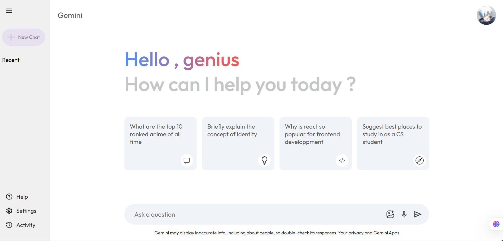

# Gemini Chat Bot

A lightweight, fast React application that lets you chat with Google's Gemini models. Built with Vite for instant dev feedback and a minimal footprint. Type a prompt, get an answer, and keep the conversation going — all in a clean, responsive UI.

## Key Features
- Conversational chat with Google Gemini (`gemini-2.5-flash`)
- Message history within the current chat session
- Loading indicator while the model is generating a response
- Quick-start prompt cards on the home screen
- Markdown-friendly answers (headings, lists, code, etc.)
- Clean, responsive UI with a collapsible sidebar

## Tech Stack
- React 19
- Vite 7 (build tool and dev server)
- @google/generative-ai (Gemini API SDK)
- marked (for Markdown rendering support)
- ESLint 9 (linting) with React plugins

## Getting Started

### Prerequisites
- Node.js 18+ and npm
- A Google AI Studio API key (Gemini)

### Installation
1. Clone the repository
2. Install dependencies:
   ```bash
   npm install
   ```
3. Create a `.env` file in the project root and add your API key:
   ```bash
   VITE_GEMINI_API_KEY=your_api_key_here
   ```

### Run the app
```bash
npm run dev
```
The app will start on a local Vite dev server (URL is printed in the terminal).

### Build for production
```bash
npm run build
```
Preview the production build locally:
```bash
npm run preview
```

## Usage
- Type your question in the input at the bottom and press Enter or click the send icon
- Click the app title "Gemini" to start a new chat session
- Model configuration lives in `src/config/gemini.js` and uses `import.meta.env.VITE_GEMINI_API_KEY`

## Project Structure (high level)
- `src/components` — UI components for the main chat and sidebar
- `src/context/ContextProvider.jsx` — app state: input, messages, loading, send handler
- `src/config/gemini.js` — Gemini SDK setup and `run(prompt)` helper
- `public/` — static assets


## Notes
- Safety: AI responses may be inaccurate. Please verify before use.
- Privacy: Do not include secrets in prompts. Your API key stays client-side for local development.
